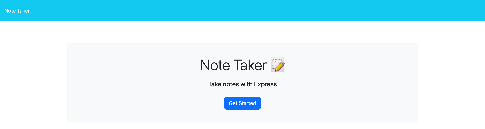
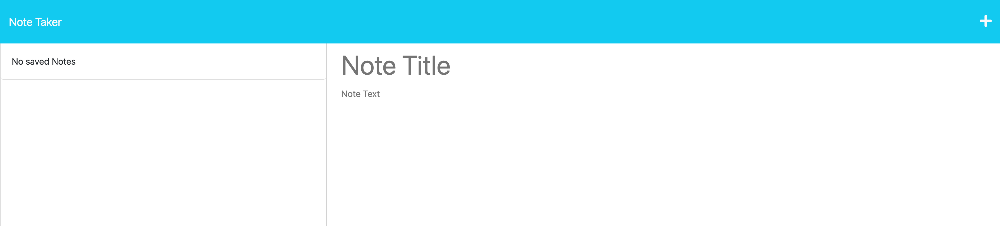

# Note Taker Using Express

## Description

Simple note taker using express routing and server functions

## Table of Contents

- [Installation](#installation)
- [Usage](#usage)
- [License](#license)
- [Contibution](#contribution)
- [Tests](#tests)
- [Questions](#questions)

## Installation

Visit https://note-taker-dylan-stoudt-3fc40d92e5ce.herokuapp.com/ to access the homepage

To run locally:
Clone project, Run "NPM I" and "node server.js", access web app via "localhost:3001"

## Usage
SImply visit the URL https://note-taker-dylan-stoudt-3fc40d92e5ce.herokuapp.com/ to access the homepage, simply click on "Get started" to be taken to the notes directory, on this page you will be able to write a note with a title and body, you may save the note and it will populate on the left, click that notes title to see the body. you may also delete the notes.

Alternatively, opening "localhost:3001" in browser while the server is running locally, you will be taken to the homepage, simply click on "Get started" to be taken to the notes directory, on this page you will be able to write a note with a title and body, you may save the note and it will populate on the left, click that notes title to see the body. you may also delete the notes.

## License

## Contribution

## Tests

## Questions

https://www.github.com/dylanstoudt
-----------------
dylanstoudt@aol.com
-----------------
Please contact me via: Email
